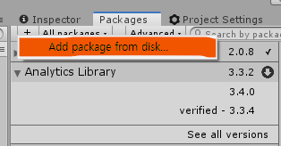

# SheetImporter 0.0.1

## 기능
1. 엑셀 파일을 (.xlsx) 바이너리 파일 (.bytes)로 변환.
2. 테이블의 코드 파일(.cs) 생성

## 지원 자료형
- [x] int
- [x] int[]
- [x] short
- [x] short[]
- [x] long
- [x] long[]
- [x] float
- [x] float[]
- [x] bool
- [x] bool[]
- [x] string
- [x] string[]

## 개발 예정
- 바이너리 파일을 유니티 에디터에서 확인할 수 있도록 커스텀 에디터 지원
- 코드와 바이너리 파일이 생성되는 위치를 커스텀 에디터에서 설정

## 예제

### 엑셀 파일 설정 방법
- 첫번째 행은 자료형을 정의합니다.
	- "#" 은 주석 컬럼으로 인식하여 바이너리가 생성되지 않습니다.
- 두번째 행은 컬럼명을 정의합니다.
	- 인덱싱에 사용할 컬럼명은 반드시 "Index"여야 합니다.
- 세번째 행부터 테이블 데이터를 입력합니다. 단, 빈 값이 있으면 안 됩니다.
	- 사용하지 않는 셀은 0 이나 NULL 로 채워주세요.
	- 배열 형태의 자료 값은 ';' 로 구분합니다. 값 마지막에는 꼭 ';' 를 붙여주세요.

| **int**       | **string**       | **int**       | **float**       | **bool**       | **#**       | **int[]**       |
|--------------|--------------|-----------|-------------|------------|------------|------------|
| **Index** | **stringColumn** | **intColumn** | **floatColumn** | **boolColumn** | **comment**       | **intArr**       |
| 10000         | row1         | 1         | 1.1         | TRUE       | 주석입니다       |1;2;3;
| 10001         | row2         | 10        | 3.14        | FALSE      | 이 열은 사용안함       |1;

### 엑셀 테이블 변환 방법
- 엑셀 파일을 유니티 프로젝트 내에 복사합니다.
- 파일을 오른쪽 클릭하여 XLSXImport 메뉴를 클릭하면 변환됩니다.
	- 다중 파일도 변환 가능.
	


- 클래스 파일은 Assets/Scripts/Data 에 생성됩니다.
- 바이너리 파일은 Assets/Data 에 생성됩니다.

### 패키지 설치 방법
- Unity PackagerManager 의 기능을 활용하였습니다.
- SheetImporter 폴더를 [프로젝트경로]/Package 에 저장하거나,
- Window-PackageManager 에서 Add package from disk로 package.json 파일을 불러오세요.



### 테이블 접근 예제

```csharp
// Index타입 , 클래스타입
public Table<int, TestTable> testTable = new Table<int, TestTable>();

// 바이너리 파일의 경로로 초기화
testTable.Initailize(Path.Combine(Application.datapath, "testTable.bytes")); // Assets/testTable.bytes

// index 기반 접근
Debug.Log(testTable[10000].stringColumn);

// 조건부 탐색 접근
Debug.Log(testTable.Find(x=>x.Index == 10000).stringColumn);
```

## Relation projects
- [dotnetcore/NPOI](https://github.com/dotnetcore/NPOI)